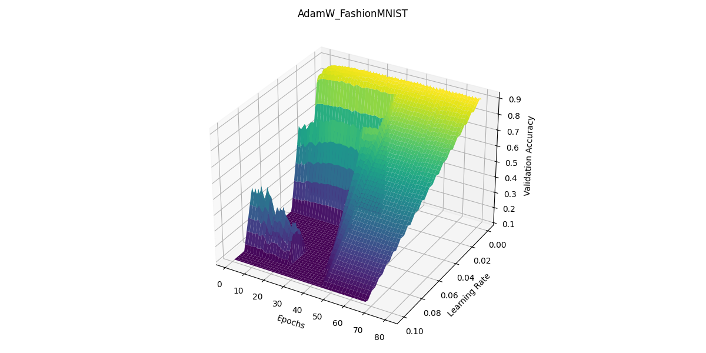
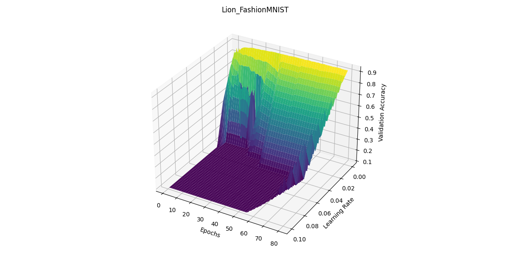
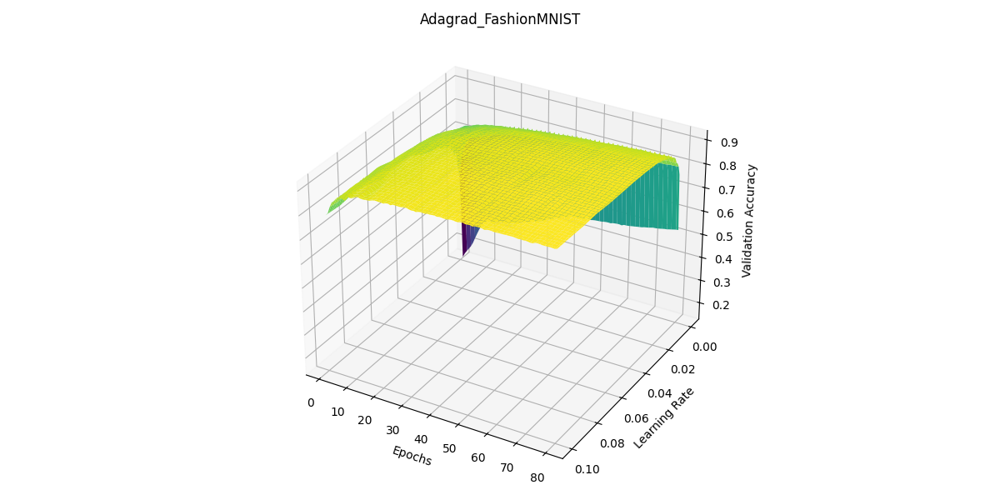
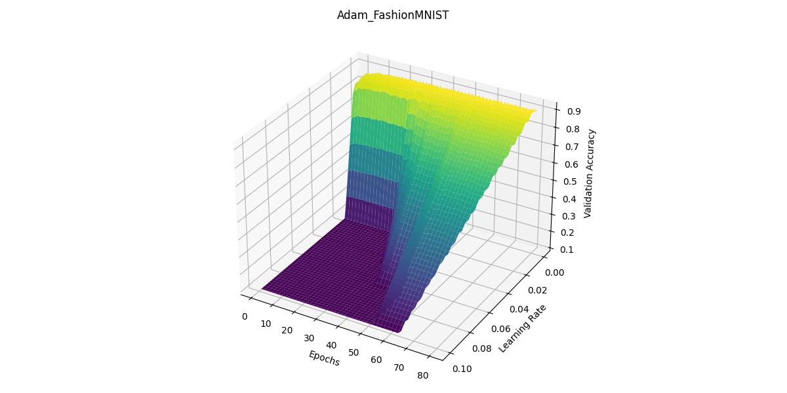
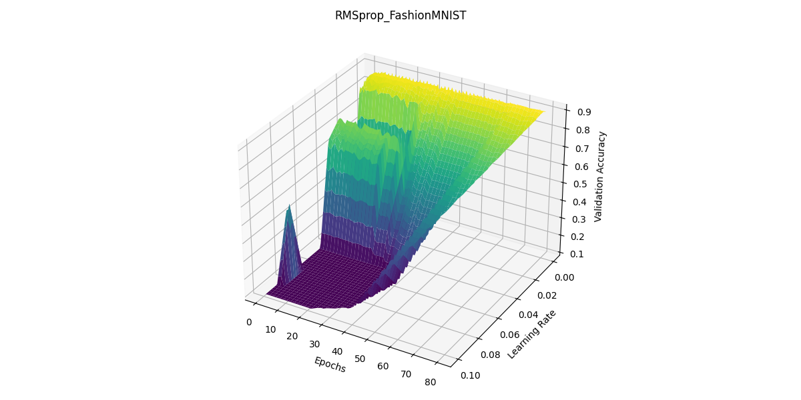
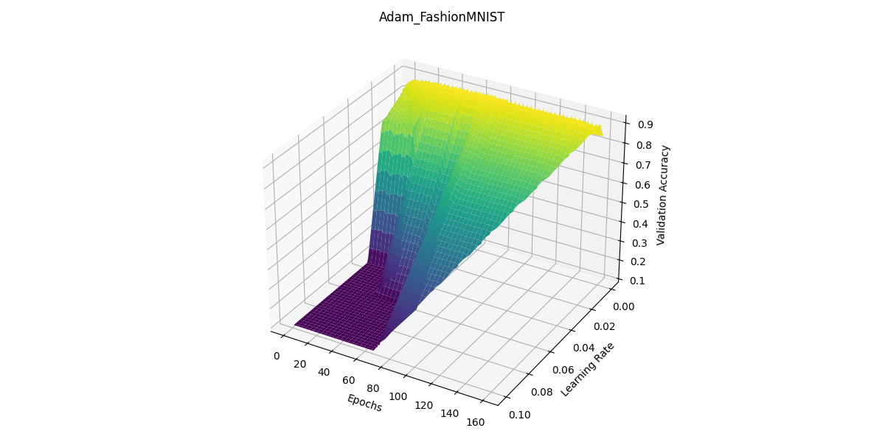
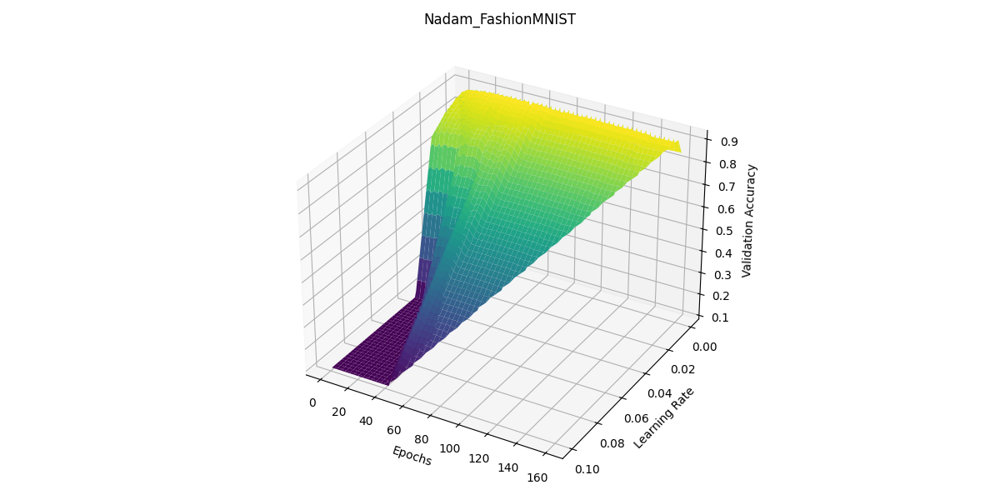
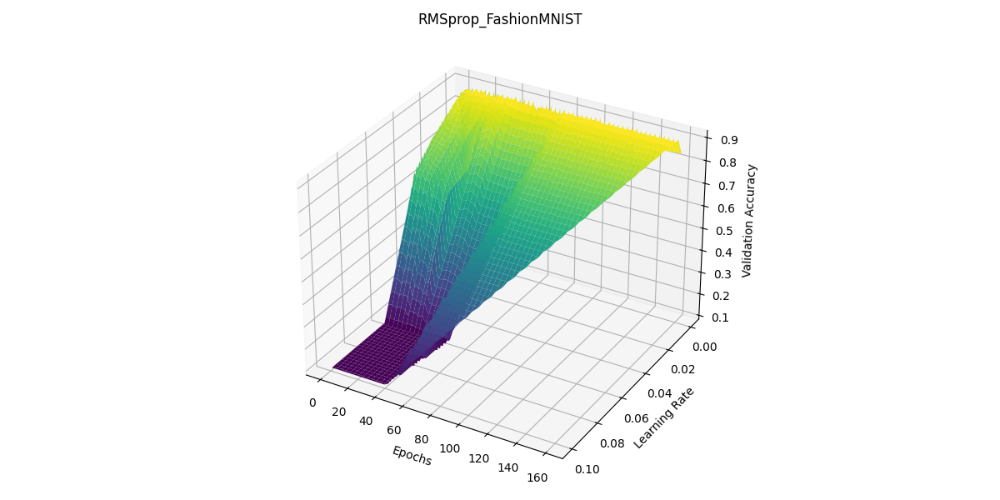

# Case Study: Using Lion to Solve a Convex Optimization Problem

## 1. Chosen Problem: Image Classification

Image classification is a fundamental problem in computer vision with numerous applications, such as healthcare, autonomous driving, and security. The objective of image classification is to assign a label to an image based on its content.

## 2. Dataset Used

### Overview

| **Dataset**        | **Fashion MNIST**                                                                   |
|--------------------|-------------------------------------------------------------------------------------|
| **Description**    | A dataset of grayscale images of clothing items designed to replace the classic MNIST database. |
| **Total Images**   | 70,000                                                                              |
| **Image Shape**    | 28x28 grayscale                                                                     |
| **Number of Categories** | 10                                                                            |
| **Training Set**   | 60,000 images                                                                       |
| **Test Set**       | 10,000 images                                                                       |
| **Categories**     | T-shirt/top, Trouser, Pullover, Dress, Coat, Sandal, Shirt, Sneaker, Bag, Ankle boot|
| **Purpose**        | Image classification                                                                |
| **Creator**        | Zalando Research Lab                                                                |

### Data Sample

You can find a sample in this [repository](https://github.com/zalandoresearch/fashion-mnist).

### Preprocessing

This preprocessing code snippet is commonly used in preparing image data for training a machine learning model, particularly in deep learning with neural networks. Let's break it down step by step:

1. **Normalization**:
    ```python
    self.train_images = self.train_images / 255.0
    self.test_images = self.test_images / 255.0
    ```
    - **Purpose**: Normalizing pixel values to be between 0 and 1.

2. **Adding a Channel Dimension**:
    ```python
    self.train_images = np.expand_dims(self.train_images, -1)
    self.test_images = np.expand_dims(self.test_images, -1)
    ```
    - **Purpose**: Adding a new dimension to the image arrays to match the shape expected by the model.

## 3. Model Description

The chosen model is a Convolutional Neural Network (CNN). This model includes three convolutional layers, each followed by a max-pooling layer. Dropout layers are included to prevent overfitting. The model ends with two dense layers, the last one being the output layer with a shape of 10, corresponding to the number of classes in the dataset.

### Model Architecture

| Layer (type)                 | Output Shape       | Param #   | Activation | Regularization              |
|------------------------------|--------------------|-----------|------------|-----------------------------|
| conv2d (Conv2D)              | (None, 26, 26, 32) | 320       | relu       | None                        |
| max_pooling2d (MaxPooling2D) | (None, 13, 13, 32) | 0         | None       | None                        |
| dropout (Dropout)            | (None, 13, 13, 32) | 0         | None       | Dropout(0.25)               |
| conv2d_1 (Conv2D)            | (None, 11, 11, 64) | 18,496    | relu       | None                        |
| max_pooling2d_1 (MaxPooling2D)| (None, 5, 5, 64)  | 0         | None       | None                        |
| dropout_1 (Dropout)          | (None, 5, 5, 64)   | 0         | None       | Dropout(0.25)               |
| conv2d_2 (Conv2D)            | (None, 3, 3, 64)   | 36,928    | relu       | None                        |
| flatten (Flatten)            | (None, 576)        | 0         | None       | None                        |
| dense (Dense)                | (None, 64)         | 36,928    | relu       | l2(0.001)                   |
| dropout_2 (Dropout)          | (None, 64)         | 0         | None       | Dropout(0.5)                |
| dense_1 (Dense)              | (None, 10)         | 650       | softmax    | None                        |

*Total params:* **93,322 (364.54 KB)**  
*Trainable params:* **93,322 (364.54 KB)**  
*Non-trainable params:* **0 (0.00 B)**

## 4. Training

We want to compare the capabilities of the Lion optimizer with other classic optimizers. The chosen competitors are:

- Adam
- AdamW
- Nadam
- RMSprop
- SGD
- Adagrad

### Training Parameters

#### 40 Epochs

| Parameter           | Value                                  |
|---------------------|----------------------------------------|
| Optimizers          | Adam, AdamW, Nadam, RMSprop, SGD, Adagrad |
| Epochs              | 40                                     |
| Batch Size          | 128                                    |
| Validation Split    | 0.2                                    |
| Early Stopping Patience | 20                                |
| Learning Rates      | 0.0001 to 0.001 (step 0.0001), 0.002 to 0.01 (step 0.001), 0.02 to 0.1 (step 0.01) |

#### 80 Epochs

| Parameter           | Value                                  |
|---------------------|----------------------------------------|
| Optimizers          | Adam, AdamW, Nadam, RMSprop, SGD, Adagrad |
| Epochs              | 80                                     |
| Batch Size          | 128                                    |
| Validation Split    | 0.2                                    |
| Patience            | 20                                     |
| Learning Rates      | 0.01 to 0.09 (step 0.01), 0.1 to 1.0 (step 0.1) |

#### 160 Epochs Parameters

| Parameter           | Value                                  |
|---------------------|----------------------------------------|
| Optimizers          | Adam, AdamW, Nadam, RMSprop, SGD, Adagrad |
| Epochs              | 160                                    |
| Batch Size          | 128                                    |
| Validation Split    | 0.2                                    |
| Patience            | 20                                     |
| Learning Rates      | Logarithmic scale from \(10^{-5}\) to \(10^{-1}\) |

We use a logarithmic scale for learning rates because it is a common practice in deep learning to search for the optimal learning rate on a logarithmic scale.

## 5. Training

### Loss Function

In this classification problem, we use the sparse categorical cross-entropy loss function, suitable for multi-class classification problems where the target labels are integers.

The sparse categorical cross-entropy loss function is defined as:

\[
\text{Loss} = -\frac{1}{N} \sum_{i=1}^{N} \log P(y_i | x_i)
\]

where:
- \( N \) is the number of samples in the dataset.
- \( y_i \) is the true label of the \( i \)-th sample.
- \( x_i \) is the \( i \)-th input sample.
- \( P(y_i | x_i) \) is the predicted probability of the true label \( y_i \) given the input \( x_i \).

### Metrics

We choose accuracy as the metric to evaluate the performance of the model. The accuracy is defined as the ratio of the number of correct predictions to the total number of predictions made by the model.

\[ \text{Accuracy} = \frac{\text{Number of Correct Predictions}}{\text{Total Number of Predictions}} \]

## 6. Technical Implementation

### Libraries Used

- **TensorFlow GPU/Keras** for model construction and training (1 second per epoch on a NVIDIA GeForce RTX 4070).
- **NumPy** for data processing.
- **Matplotlib** for result visualization.

You can find the open source code [here](https://github.com/NoeBrt/Roaaar-Convex-Model).

### Example Implementation with the Lion Optimizer

```python
optimizer = keras.optimizers.Lion(learning_rate=lr)

self.model.compile(optimizer=optimizer,
    loss='sparse_categorical_crossentropy', 
    metrics=['accuracy'])
history = self.model.fit(self.train_images, 
    self.train_labels, 
    epochs=epochs, 
    batch_size=batch_size,
    validation_split=0.2) 
```

## 7. Results

### Visualizing Methodology

We use a 3D projection to visualize the results of the training. We use the following axes:

- **x-axis**: Learning Rate Range
- **y-axis**: Epochs (0-40; 0-80; 0-160)
- **z-axis**: Accuracy Value

We use a color gradient to represent the accuracy value. The color gradient goes from purple (low accuracy) to green (high accuracy).

The plots are made with matplotlib and the 3D projection. [(see the code here)](https://github.com/NoeBrt/Roaaar-Convex-Model.git)

#### Example Plot

<div align="center">


*Wrong size & orientation :\(*


*It's better (with a little bit of interpolation) :\)*

</div

>

### Plots Comparison

#### 40 Epochs

| Lion 40                                | Adagrad 40                                |
|----------------------------------------|-------------------------------------------|
|   |  |

| Adam 40                                | AdamW 40                                  |
|----------------------------------------|-------------------------------------------|
|   |     |

| Nadam 40                               | RMSprop 40                                |
|----------------------------------------|-------------------------------------------|
| | |

#### 80 Epochs

| Lion 80                                | Adagrad 80                                |
|----------------------------------------|-------------------------------------------|
|      |    |

| Adam 80                                | AdamW 80                                  |
|----------------------------------------|-------------------------------------------|
|      |        |

| Nadam 80                               | RMSprop 80                                |
|----------------------------------------|-------------------------------------------|
|    |    |

#### 160 Epochs

| Lion 160                               | Adagrad 160                               |
|----------------------------------------|-------------------------------------------|
|    |  |

| Adam 160                               | Nadam 160                                 |
|----------------------------------------|-------------------------------------------|
|    |      |

| RMSprop 160                            |                                            |
|----------------------------------------|-------------------------------------------|
| |                                           |


